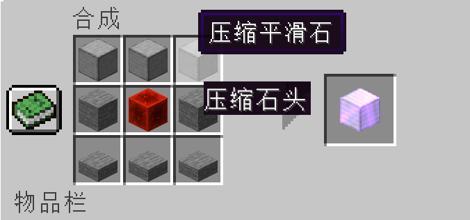
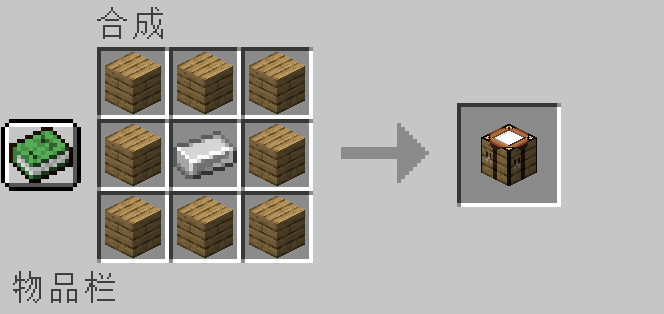
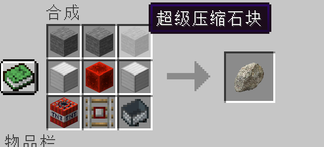

# Fresh & Potato

#### 介绍
对同学进行深度改造

#### 软件架构
基于Java

#### 安装教程

1.  将jar（.jar）后缀文件放入Minecraft文件夹里的mods文件夹里
2.  注意你的版本号与mod是否符合
3.  打开Minecraft

#### 使用方法

1.  确认你的mc版本与此模组版本号相同
（关于确认模组版本的具体方法：
  1. 一般情况来说，模组的命名上就有版本号
  2. 如果没有，请将模组（.jar）解压后（最好备份一下），打开文件夹，在第一个目录里有一个后缀为“.mcmeta”，将其后缀名改为“.txt”，打开
  3. 打开后，你会看见类似于的文字，其中，“pack_format：9”中的9就是代表的1.19.2里的9
  4. 查看完后记得还原此mod，或者重新下载）

#### 参与贡献

1.  By Onism

#### 1.1.0 更新日志

Fresh&Potato Mod-1.19.2-Forge-1.1.0更新日志

新增：

Yangyu世界维度

·增加Yangyu世界，增加玩家游戏时更多的快乐

Tudou世界维度

·增加Tudou世界维度，增加玩家游戏时更大的快乐

Potato成就进度

·当玩家用有"Potato"物品时，会得到一个名为Potato的成就

Potatoblock

·一个PotatoBlock

优化：

·暂无Bug，无法优化

修复：

·暂无Bug，无法修复

#### 1.2.0更新日志

MineCraft Fresh&Potato Mod-1.19.2-Forge-1.2.0更新日志

新增：

IronMachine（刷铁机）

·增加一键生成刷铁机工具，这下让你的Minecraft世界更加方便。

·配方：最上面一层三个平滑石，中间一层两边是石头，中间是红石，最下面一层是三个石头台阶

优化：

·各个贴图的优化，比原来更自然

修复：

·暂无Bug，无法修复

其他：

·刷铁机工具目前有一点问题，将会在下次更新时修复，为了不损害你的存档，还是暂时先不用吧😊（其实也没啥问题，就是结构文件没有保存完整，生成出来会被切掉一部分）

#### 1.3.1更新日志
**Fresh&Potato Mod更新日志 - 版本 1.3.1**

*发布日期：2023年8月28日*

**新增内容：**

1. **超级压缩工作台（Hypercompressor）**
   - 引入全新的超级压缩工作台，可用于合成压缩石头和压缩平滑石。（包括超级压缩石头以及超级压缩平滑石）
   - 超级压缩工作台限定了超级压缩石头、平滑石的合成，其他工作台无法完成此操作。

2. **刷石机生成工具**
   - 现在可以利用刷石机生成工具，轻松产生石块，进一步改善游戏中的资源获取体验。

3. **全新食材 - 土豆**
   - 引入美味的土豆食物，与原版不同的是，拥有更出色的画质和效果。
   - 消耗土豆时，玩家将获得“土豆之力”药水效果，该效果赋予：
     - 生命增加
     - 夜视能力
     - 速度提升
     - 生命恢复属性

**修复与优化：**

1. 修复了刷铁机生成模型被切割的问题
   - 注意：现在刷铁机上的僵尸需要玩家手动放置。

2. 优化刷铁机生成器的配方
   - 配方现已调整为更具挑战性，玩家需要更多努力才能合成刷铁机生成器。

3. 压缩石头合成调整
   - 现在，超级压缩机内需要放置九个石头或平滑石，才能合成压缩石头等物品。

**其他变更：**

- 进行了一些小的界面优化和调整，以提升整体游戏体验。

**配方**

**感谢各位玩家的支持与反馈！请尽情享受这次更新带来的全新内容。记得随时关注我们的社区，获取更多游戏动态与未来更新预告。如有任何问题或建议，请与我们联系。祝您玩得愉快！**

*注：本更新内容可能因游戏版本和平台而异。请确保您的游戏已更新至最新版本以获取最佳体验。*

---
*请根据您的实际情况进行修改，上述内容仅供参考。如果您有任何其他要求或调整，请随时告知。*