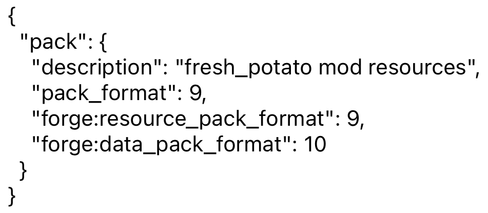

# Fresh Potato

#### 介绍
对同学进行深度改造

#### 软件架构
基于Java

#### 安装教程

1.  将jar（.jar）后缀文件放入Minecraft文件夹里的mods文件夹里
2.  注意你的版本号与mod是否符合
3.  打开Minecraft

#### 使用方法

1.  确认你的mc版本与此模组版本号相同
（关于确认模组版本的具体方法：
  1. 一般情况来说，模组的命名上就有版本号
  2. 如果没有，请将模组（.jar）解压后（最好备份一下），打开文件夹，在第一个目录里有一个后缀为“.mcmeta”，将其后缀名改为“.txt”，打开
  3. 打开后，你会看见类似于的文字，其中，“pack_format：9”中的9就是代表的1.19.2里的9
  4. 查看完后记得还原次mod，或者重新下载）

#### 参与贡献

1.  By Onism

#### 1.1.0 更新日志

Fresh&Potato Mod-1.19.2-Forge-1.1.0更新日志

新增：

Yangyu世界维度

·增加Yangyu世界，增加玩家游戏时更多的快乐

Tudou世界维度

·增加Tudou世界维度，增加玩家游戏时更大的快乐

Potato成就进度

·当玩家用有"Potato"物品时，会得到一个名为Potato的成就

Potatoblock

·一个PotatoBlock

优化：

·暂无Bug，无法优化

修复：

·暂无Bug，无法修复